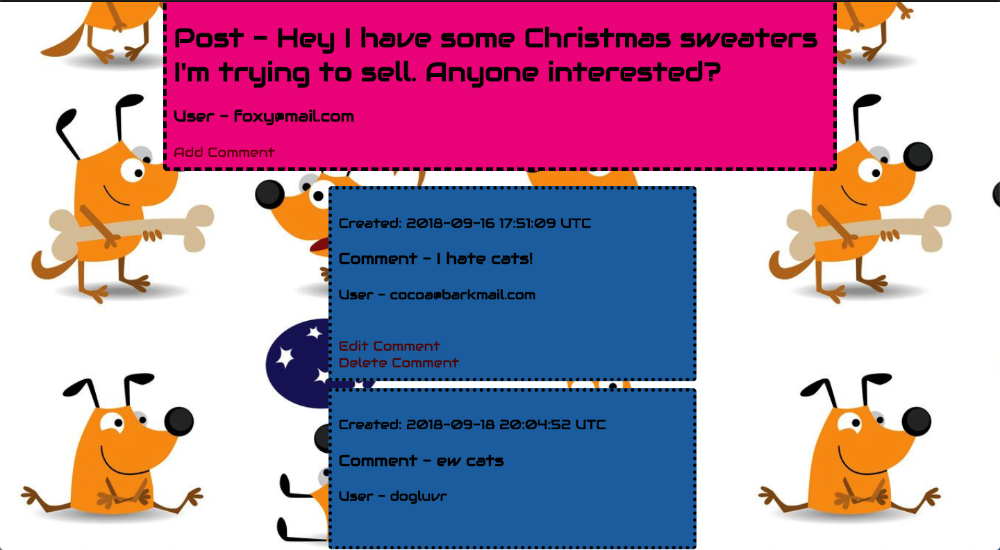
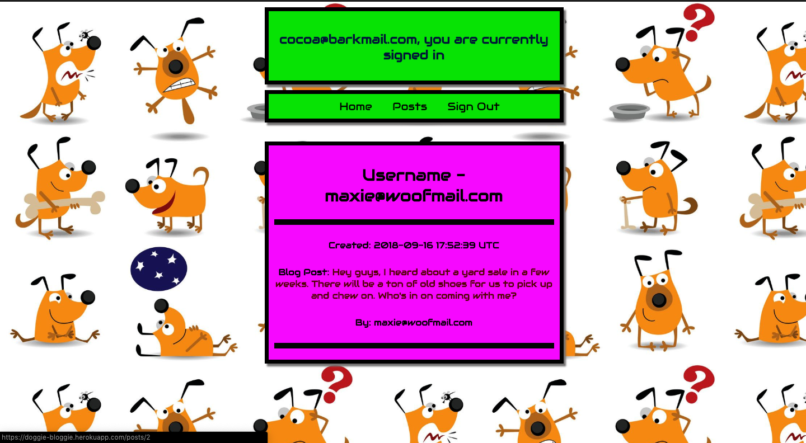
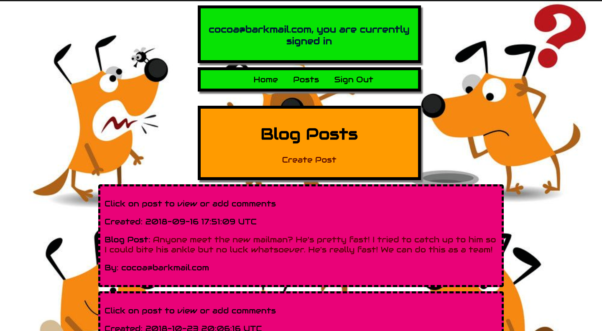

# README

# Welcome to Doggie-Bloggie! 
A place where pets can gripe about their owners and what's new in the neighborhood.
# Username: guest 
# Password: guestpass

Create users, edit them or delete them from the database.

# CRUD all users/posts and comments on posts.

# Mobile responsive

Styling is built completely library free with no frameworks. 

Feel free to play around and have fun with the site. You can view some of the silly posts and comments my pets exchanged in the database. 

You can also download the zipfile if you'd like to clone the project by running these commands from the command line:

git clone git@github.com:angelr1076/rails-doggie-blog.git

Type 'rails s' or 'rails server' to run locally after cloning from the root folder

Go to your web browser and type in https://localhost:3000

* Ruby version
2.5.1

